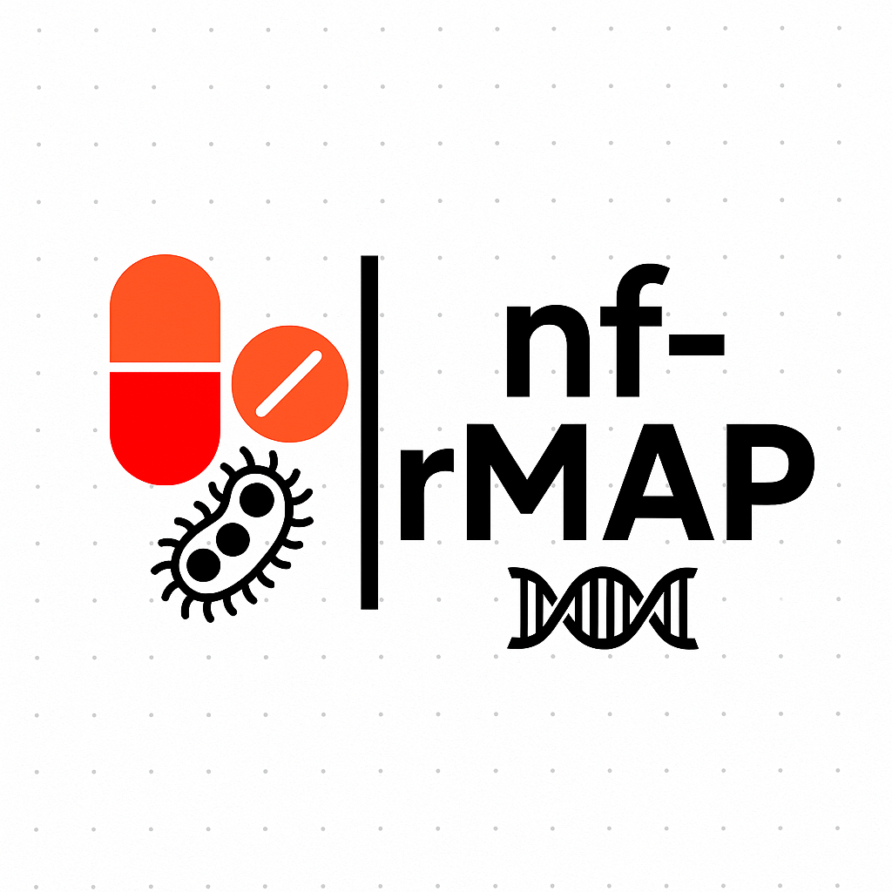

# nf-rMAP

nf-rMAP: Nextflow-powered microbial genomics pipeline for rapid antimicrobial resistance analysis. Implements rMAP's core functionality with cloud-native scalability, enhanced QC, & modular workflows. Processes Illumina data through assembly, annotation, AMR detection & phylogenetics. 

---



---

## A Scalable microbial genomics pipeline for antimicrobial resistance profiling

**nf-rMAP** is a Nextflow implementation of the original rMAP pipeline, offering:
- Cloud-native microbial genome analysis  
- Comprehensive AMR/Virulence factor detection
- Production-grade variant calling & phylogeny
- 10x faster processing through parallelization

**Key features**  
✔️ Full-stack analysis from raw reads to clinical reports  
✔️ Supports Illumina data  
✔️ Automated QC & MultiQC reporting  
✔️ One-click Azure/AWS/GCP deployment  


### Installation

```bash

# Install Nextflow (requires Java 11+)
curl -s https://get.nextflow.io | bash

# Install dependencies via Conda (optional)
conda env create -f nf-rMAP.yml

```

# Minimal run

```bash

nextflow run nf-rMAP/main.nf \
    --input "data/*_{1,2}.fastq.gz" \
    --outdir results \
    -profile docker
```

# Requirements

```bash

- Nextflow 21.10.3+
- Docker 20.10+ or Singularity 3.7+
- Conda/Mamba (Optional) 

```

# Install Nextflow


```bash

curl -s https://get.nextflow.io | bash
sudo mv nextflow /usr/local/bin/

```

# Set up Docker

```bash
sudo apt-get install docker.io
sudo systemctl start docker
sudo usermod -aG docker $USER
# Re-login to apply changes


```

# Clone repository


```bash

git clone https://github.com/gmboowa/nf-rMAP.git

cd nf-rMAP

```

# Usage 


Basic analysis

```bash

nextflow run main.nf \
    --input "samples/*_R{1,2}.fastq.gz" \
    --outdir final_results \
    --amr \
    --cpus 16 \
    -with-report execution.html
```

# Advanced run

```bash

nextflow run main.nf \
    --input "s3://my-bucket/reads/*.fastq" \
    --reference data/ESKAPE_ref.gbk \
    --assembly shovill \
    --amr \
    --phylogeny \
    --pangenome \
    --outdir s3://results-bucket/ \
    -profile awsbatch \
    -resume
```
# Configuration parameters

Parameter	default	description

---

```bash

--input	Required	Input FASTQ path/pattern
--outdir	./results	Output directory
--reference	None	Reference genome (.gbk/.fasta)
--assembly	megahit	Assembler: megahit/shovill
--cpus	4	Total CPUs to use
--memory	32.GB	Per-job memory allocation
--amr	false	Enable AMR detection
--phylogeny	false	Build phylogenetic trees

**View all parameters with** --help

```
# Output structure
---

```bash
results/
├── reports/               # Quality control reports
├── assembly/              # Draft genomes (FASTA)
├── annotation/            # Prokka annotations (GBK)
├── variant_calling/       # VCFs & SNP tables
├── resistance_genes/      # AMR/Virulence factors
├── phylogeny/             # Newick trees & alignments
└── multiqc_report.html    # Consolidated QC
```


# Contributing 

- We welcome contributions!
- Open an issue to discuss proposed changes
- Fork repository and create feature branch
- Submit PR with detailed description
- Follow original rMAP repository here **https://github.com/GunzIvan28/rMAP**


# Citation 

If you use nf-rMAP in your research, please cite: Sserwadda I, Mboowa G. rMAP: the Rapid Microbial Analysis Pipeline for ESKAPE bacterial group whole-genome sequence data. Microb Genom. 2021 Jun;7(6):000583. doi: 10.1099/mgen.0.000583. PMID: 34110280; PMCID: PMC8461470.
